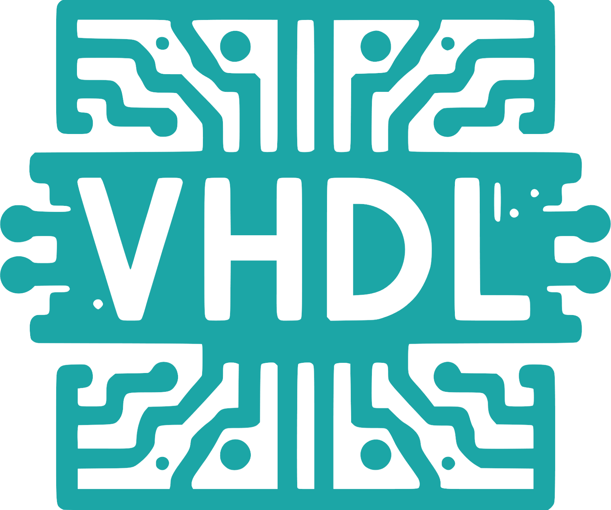

         

# My-VHDL
If you're a college student reading this I suggest you go through the directories, you might find something useful.

There are a lot of nonesensical files here that I have no idea about the purpose of but what you want to look for are: 

- ### .v files:
  - Verilog code, probably what you're looking for.
- ### .bdf files:
  - Block/Schematic Files, visual representations of the circuits (Can be opened by Quartus, Modelsim, MaxIIplus)
- ### .vwf files:
  - Vector Waveform Files, for the waveforms, although I'd say you're better off just getting the output yourself (Can be opened with the same files)

## Verilog:
- ### Arithmetic-Logic-Unit.v:
    - This is a fully functioning 4-bit Arithmetic Logic Unit (ALU) with the added ability to shift the A[3:0] input left or right if the SEL3 bit is set to high.
    - Schematics and truth table:
      

         
      

    - Waveform:
      

         
      

- ### Arithmetic-Operations.v:
    - This is the "Arithmetic Circuit" mentioned in the schema above.
    - Schematics and truth table:
      

         
      

    - Waveform:
      

         
      

